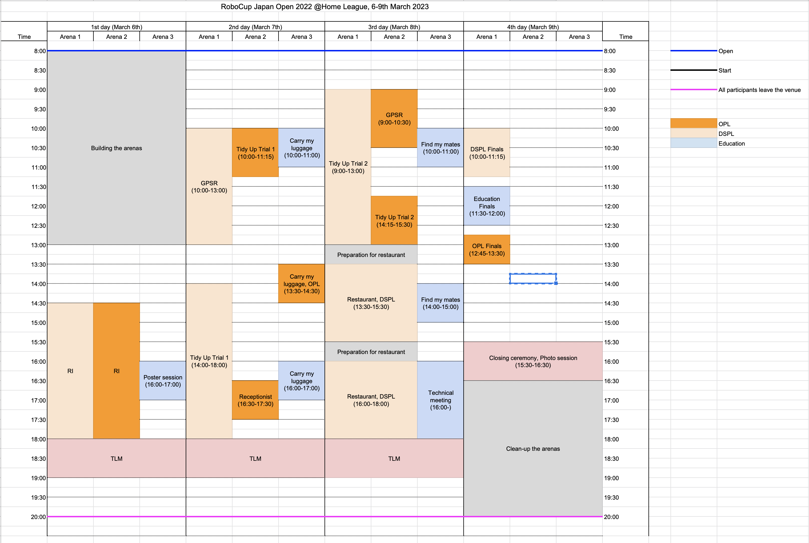

<h1>最新情報は<a href="https://sites.google.com/site/robocuphomejapan/%E3%82%B8%E3%83%A3%E3%83%91%E3%83%B3%E3%82%AA%E3%83%BC%E3%83%97%E3%83%B32022%E9%96%8B%E5%82%AC%E6%83%85%E5%A0%B1">ジャパンオープン2022 開催情報</a> ページをご覧ください！</1>

# RoboCup JapanOpen 2022 @Home League

# 情報発信サイト

RoboCup JapanOpen 2022 @ホームリーグの情報発信用リポジトリです．

2022年度OPL/DSPL/Education開催決定！

## 会場
東京大学本郷キャンパス 工学部2号館1階　機械系演習室

### 自動車でのお越しについて
大学構内は日常的に混雑しているため、自動車でのお越しは荷物の搬入等短時間でのご利用以外ではご遠慮ください．また駐車料金が発生しますのでご注意ください．

## スケジュール
- 2023年3月6日(月)：セットアップデイ
- 2023年3月7日(火)～9日(木)：タスク実施日

### 撤収について
3/9(木)の各チームのロボット撤収はFinals終了後写真撮影を行います．できるだけ多くのチームに写真撮影時にロボットと一緒に写っていただければと思います。その後、各チームの資材撤収をお願いいたします．

また、フィールドの撤収も行いますので、できるだけ多くの方のご協力をお願いいたします．

## DSPL
- General Information
    - [オブジェクトリスト（with Predefined Location）](data/dspl_objects_with_predefined-loc.pdf)

- Robot Inspection
    - 入口：Tidy Upアリーナ（Arena 1）のEntrance
    - 出口：Tidy Upアリーナ（Arena 1）のObstacle Avoidance Area

- GPSR
    - [質問リスト](data/questions.md)
    - [人物名リスト](data/name_list.md)
    - [地図](data/gpsr_map.pdf)

## OPL
- [オブジェクトリスト](https://github.com/RoboCupAtHomeJP/AtHome2021/blob/master/Data/opl_known_object_list.pdf)
- [Setup Day公開情報(Pre-defined)](data/OPL公開資料(Setup%20Day).pdf)

# LINK
- [ルール公開サイト](https://github.com/RoboCupAtHomeJP/Rule2022)
